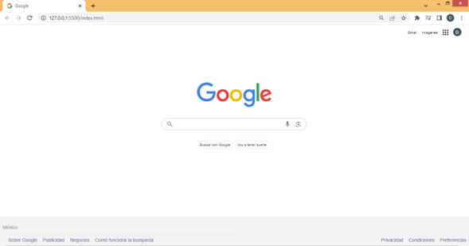

# clon-google
<h1 align="center"> Clon de google </h1>
Proyecto creado en *Tecnolochicas Pro* simulando la pagina principal de navegador de google.
Se vincularon algunas de las paginas o opciones principales que nos ofrece google en su pagina principal.

Poniendo en practica lo aprendido en TecnolochicasPro
## 1.Intro
El proyecto fue creado con **html y css** se trata del navegador mas usado.
Este se puede visitar en el iguiente enlace 

 
**Inspirate en este proyecto, tu puedes ser una gran desarrolladora y explorar el mundo de la programacion**
## Contenido del proyecto 
 
1. *hooter:*
Seccion que muestra el menú y foto del perfil.
 2.*main:* 
Contiene los elementos centrales del navegador.
 3.*footer:*
Incluye los hipervinculos al fina de la pagina.
Realizado por **Diana Yolotzin Felix Villa**
